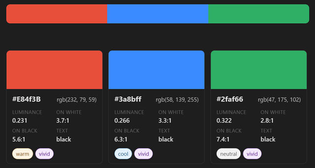
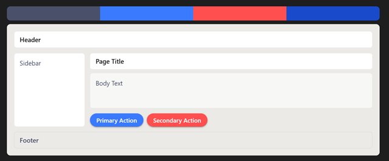

# Palette Renderer

An Obsidian plugin that renders color palettes and design system documentation directly in your notes. Create beautiful, interactive color swatches and UI wireframe mockups with semantic design tokens.

**Features:**
- `palette-swatch` - Render color swatches with computed properties (contrast ratios, luminance, temperature, etc.)
- `palette-wireframe` - Render complete design-system and theme wireframes
- Live settings preview - Preview syntax with interactive demos

### Swatch Demo




## Quick Start

### Swatch Example

Create a code fence with `palette-swatch` language:

````markdown
```palette-swatch
swatch-only: false
#E84F3B
#3A8BFF
#2FAF66
```
````
This renders three color chips. Add properties for a specific output:

````markdown
```palette-swatch
hex: #FF4FA8
rgb: 255, 79, 168
ral-id: RAL Classic 4003
ral-name: Heather Violet
```
````

### Wireframe Example

Create a code fence with `palette-wireframe` language:

````markdown
```palette-wireframe
text-secondary: #4A506A
accent-primary: #3A7AFF
accent-secondary: #FF4F4F
accent-link: #1A4ACC
```
````

This renders an interactive UI mockup using your design tokens.
Any omitted properties use sensible defaults.

**To see live examples:** Open **Obsidian Settings → Palette Renderer** for interactive demos of both code fence types.

## Swatch Palette

### Properties

| Property | Required | Description | Example |
|---|---|---|---|
| `hex` | ✓ | Hex color code (triggers card view) | `#FF4FA8` |
| `rgb` | — | RGB values | `255, 79, 168` |
| `ral-id` | — | Closest RAL color match | `RAL Classic 4003` |
| `ral-name` | — | RAL color name | `Heather Violet` |
| `luminance` | — | Relative luminance (0.000–1.000) | `0.402` |
| `contrast-on-white` | — | WCAG contrast ratio vs white | `2.8` |
| `contrast-on-black` | — | WCAG contrast ratio vs black | `6.9` |
| `recommended-text` | — | Legible text color for this background | `black` or `white` |
| `temperature` | — | Perceptual color temperature | `warm`, `cool`, or `neutral` |
| `tone` | — | Perceptual classification | `vivid`, `muted`, or `neutral` |

**Note:** Providing only hex codes (one per line) renders compact color chips. Add `hex:` as a YAML property to show the detailed card view.

### Swatch Options

| Option | Type | Default | Description |
|---|---|---|---|
| `swatch-only` | boolean | `false` | Render compact color strip instead of full property cards |

Compact example:

````markdown
```palette-swatch
#FF4FA8
#3AA8FF
#1C1D1F
swatch-only: true
```
````

## Wireframe Theme

### Usage

Create a code fence with the `palette-wireframe` language to render an interactive UI mockup. Customize colors and spacing tokens for your design system.

### Light Theme Example

````markdown
```palette-wireframe
surface-base: #F7F7F5
surface-raised: #FFFFFF
surface-sunken: #ECEAE6
surface-border: #D6D4D0
text-primary: #1A1A1A
text-secondary: #4A4A4A
text-inverse: #FFFFFF
accent-primary: #1A73E8
accent-secondary: #3BAA5C
accent-link: #0A4ECF
focus-ring: #1A73E8
button-primary-background: #1A73E8
button-primary-color: #FFFFFF
button-secondary-background: #3BAA5C
button-secondary-color: #FFFFFF
radius-base: 6px
space-unit: 8px
border-width: 1px
shadow-color: rgba(0, 0, 0, 0.12)
overlay-background: rgba(0, 0, 0, 0.35)
```
````

### Dark Theme Example

````markdown
```palette-wireframe
surface-base: #141516
surface-raised: #1C1D1F
surface-sunken: #262729
surface-border: #3A3B3D
text-primary: #E6E6E6
text-secondary: #A8A8A8
text-inverse: #000000
accent-primary: #3A8BFF
accent-secondary: #2FAF66
accent-link: #6BB6FF
focus-ring: #3A8BFF
button-primary-background: #3A8BFF
button-primary-color: #FFFFFF
button-secondary-background: #2FAF66
button-secondary-color: #FFFFFF
radius-base: 6px
space-unit: 8px
border-width: 1px
shadow-color: rgba(0, 0, 0, 0.6)
overlay-background: rgba(0, 0, 0, 0.55)
```
````

### Properties

| Property | Required | Description | Example |
|---|---|---|---|
| `surface-base` | — | Page/canvas background | `#F7F7F5` |
| `surface-raised` | — | Card/panel background | `#FFFFFF` |
| `surface-sunken` | — | Recessed area background | `#ECEAE6` |
| `surface-border` | — | Border color for surfaces | `#D6D4D0` |
| `text-primary` | — | Primary text color | `#1A1A1A` |
| `text-secondary` | — | Secondary/muted text color | `#4A4A4A` |
| `text-inverse` | — | Text on dark/accent backgrounds | `#FFFFFF` |
| `accent-primary` | — | Primary brand color | `#1A73E8` |
| `accent-secondary` | — | Secondary brand color | `#3BAA5C` |
| `accent-link` | — | Hyperlink color | `#0A4ECF` |
| `focus-ring` | — | Keyboard focus indicator color | `#1A73E8` |
| `button-primary-background` | — | Primary button background | `#1A73E8` |
| `button-primary-color` | — | Primary button text color | `#FFFFFF` |
| `button-secondary-background` | — | Secondary button background | `#3BAA5C` |
| `button-secondary-color` | — | Secondary button text color | `#FFFFFF` |
| `radius-base` | — | Base border radius | `6px` |
| `space-unit` | — | Base spacing unit | `8px` |
| `border-width` | — | Default border width | `1px` |
| `shadow-color` | — | Box shadow color | `rgba(0, 0, 0, 0.12)` |
| `overlay-background` | — | Modal/overlay backdrop color | `rgba(0, 0, 0, 0.35)` |

All properties are optional. Omitted values use sensible defaults.

### Wireframe Options

| Option | Type | Default | Description |
|---|---|---|---|
| `include-swatch` | boolean | `true` | Show a color strip of all semantic colors above the wireframe |
| `enable-tooltip` | boolean | `false` | Show token name tooltips on swatch chips and wireframe elements |

Hide the color strip:

````markdown
```palette-wireframe
surface-base: #FFFFFF
text-primary: #000000
include-swatch: false
```
````


## Installation

### Requirements

- Obsidian 1.5.0 or higher
- Node.js 16+ (for building from source)

### Install from Source

1. **Install dependencies:**
   ```bash
   npm install
   ```

2. **Build the plugin:**
   ```bash
   npm run build
   ```

3. **Copy to vault:**
   ```bash
   cp -r main.js manifest.json styles.css .obsidian/plugins/palette-renderer/
   ```
   Or copy the three files manually to `.obsidian/plugins/palette-renderer/`

4. **Enable in Obsidian:**
   - Open Settings → Community Plugins
   - Find "Palette Renderer" and toggle it on

### Development

For development with live reloading:

```bash
npm run dev
```

This watches for changes and rebuilds `.obsidian/plugins/palette-renderer/main.js` for live testing in Obsidian.

`npm run build` now also attempts to reload the plugin via Obsidian CLI after syncing files.
If your CLI command differs, set `OBSIDIAN_RELOAD_CMD` in your shell before running build.

## Troubleshooting

**Plugin doesn't appear in settings:**
- Ensure files are in `.obsidian/plugins/palette-renderer/` (check folder exists at that exact path)
- Try restarting Obsidian
- Check the console for errors (Settings → About → Open logs folder)

**Code fence not rendering:**
- Verify the language is exactly `palette-swatch` or `palette-wireframe` (lowercase, lowercase)
- Check YAML syntax (properties should be `key: value`, colon required)
- Hex codes must follow `#RRGGBB` format

**Contrast/luminance values missing:**
- These are informational extras. If you omit them, the swatch still renders with the color you provide.

## License

PolyForm Noncommercial License 1.0.0

See LICENSE.md for full terms.

## Contributing

Feedback and contributions welcome. Open an issue or pull request on the repository.
